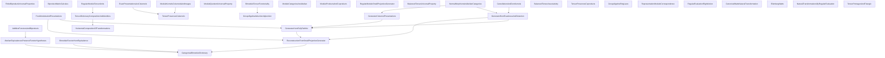

# Full dependency graph

Every active planned endpoint and its immediate dependencies. [Exact proof suppliers and verification](proof-graph.json).

```mermaid
graph TD
  FiniteBiproductUniversalProperties["FiniteBiproductUniversalProperties"]
  BiproductMatrixCalculus["BiproductMatrixCalculus"]
  AdditiveFunctorsAndBiproducts["AdditiveFunctorsAndBiproducts"]
  CancellationAndZeroKernels["CancellationAndZeroKernels"]
  NormalMorphismsInAbelianCategories["NormalMorphismsInAbelianCategories"]
  ExactPresentationsAreCokernels["ExactPresentationsAreCokernels"]
  ModuleQuotientUniversalProperty["ModuleQuotientUniversalProperty"]
  ModuleKernelsCokernelsAndImages["ModuleKernelsCokernelsAndImages"]
  ModuleCategoriesAreAbelian["ModuleCategoriesAreAbelian"]
  ModuleProductsAndCoproducts["ModuleProductsAndCoproducts"]
  FreeModulesAndPresentations["FreeModulesAndPresentations"]
  RegularModuleSmallProjectiveGenerator["RegularModuleSmallProjectiveGenerator"]
  BalancedTensorUniversalProperty["BalancedTensorUniversalProperty"]
  BimoduleTensorFunctoriality["BimoduleTensorFunctoriality"]
  RegularModuleTensorUnits["RegularModuleTensorUnits"]
  BalancedTensorAssociativity["BalancedTensorAssociativity"]
  TensorPreservesCoproducts["TensorPreservesCoproducts"]
  TensorPreservesCokernels["TensorPreservesCokernels"]
  ModuleKernelsCokernelsAndImages --> TensorPreservesCokernels
  ExactPresentationsAreCokernels --> TensorPreservesCokernels
  GroupAlgebraRingLaws["GroupAlgebraRingLaws"]
  RepresentationModuleCorrespondence["RepresentationModuleCorrespondence"]
  GroupAlgebraInductionAdjunction["GroupAlgebraInductionAdjunction"]
  BimoduleTensorFunctoriality --> GroupAlgebraInductionAdjunction
  GeneratorHomExactnessAndDetection["GeneratorHomExactnessAndDetection"]
  CancellationAndZeroKernels --> GeneratorHomExactnessAndDetection
  NormalMorphismsInAbelianCategories --> GeneratorHomExactnessAndDetection
  GeneratorCokernelPresentations["GeneratorCokernelPresentations"]
  NormalMorphismsInAbelianCategories --> GeneratorCokernelPresentations
  GeneratorHomFullyFaithful["GeneratorHomFullyFaithful"]
  GeneratorCokernelPresentations --> GeneratorHomFullyFaithful
  GeneratorHomExactnessAndDetection --> GeneratorHomFullyFaithful
  FreeModulesAndPresentations --> GeneratorHomFullyFaithful
  ReconstructionFromSmallProjectiveGenerator["ReconstructionFromSmallProjectiveGenerator"]
  GeneratorHomFullyFaithful --> ReconstructionFromSmallProjectiveGenerator
  GeneratorHomExactnessAndDetection --> ReconstructionFromSmallProjectiveGenerator
  FreeModulesAndPresentations --> ReconstructionFromSmallProjectiveGenerator
  RegularEvaluationRightAction["RegularEvaluationRightAction"]
  CanonicalWattsNaturalTransformation["CanonicalWattsNaturalTransformation"]
  EilenbergWatts["EilenbergWatts"]
  NaturalTransformationsByRegularEvaluation["NaturalTransformationsByRegularEvaluation"]
  BimoduleFunctorHomEquivalence["BimoduleFunctorHomEquivalence"]
  TensorDictionaryCompositionAndIdentities["TensorDictionaryCompositionAndIdentities"]
  RegularModuleTensorUnits --> TensorDictionaryCompositionAndIdentities
  TensorPentagonAndTriangle["TensorPentagonAndTriangle"]
  HorizontalCompositionOfTransformations["HorizontalCompositionOfTransformations"]
  TensorDictionaryCompositionAndIdentities --> HorizontalCompositionOfTransformations
  AbelianEquivalencesPreserveFunctorHypotheses["AbelianEquivalencesPreserveFunctorHypotheses"]
  AdditiveFunctorsAndBiproducts --> AbelianEquivalencesPreserveFunctorHypotheses
  CategoricalBimoduleDictionary["CategoricalBimoduleDictionary"]
  ReconstructionFromSmallProjectiveGenerator --> CategoricalBimoduleDictionary
  BimoduleFunctorHomEquivalence --> CategoricalBimoduleDictionary
  AbelianEquivalencesPreserveFunctorHypotheses --> CategoricalBimoduleDictionary
```
